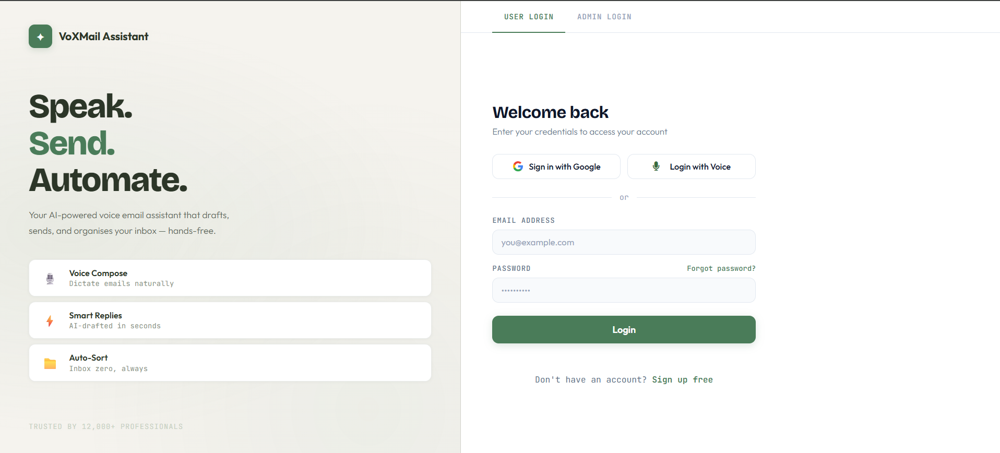
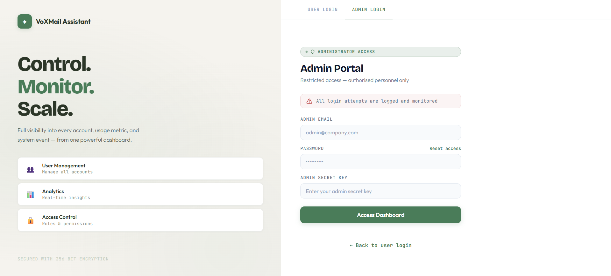
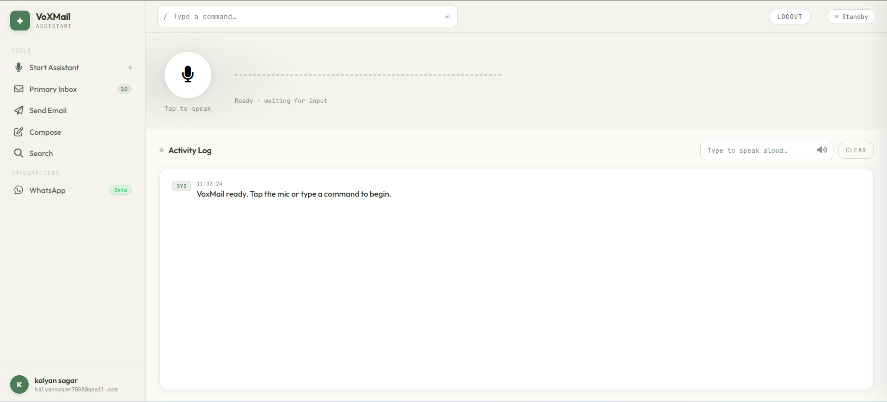
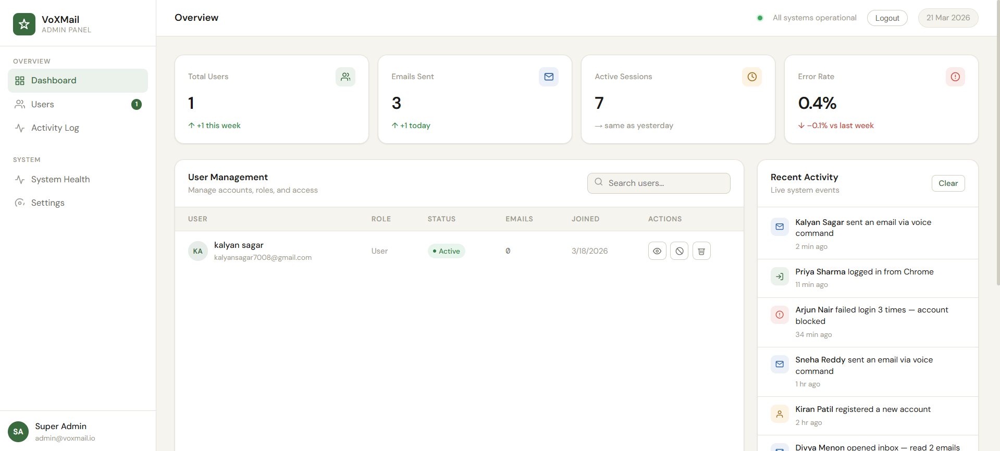

# Email Voice Assistant AI

An AI-driven voice assistant that allows users to **read, send, summarize, and manage emails using natural speech**, powered by LLM-based intent understanding and Gmail API integration.

---

## Overview

Email Voice Assistant is a full-stack system that combines **speech-to-text, natural language understanding, and email automation** to deliver a hands-free email experience.

Unlike traditional voice typing tools, this system **interprets user intent** and performs complete actions — not just transcription.

Users can issue commands like:
- "Read my latest emails"
- "Send an email to John about the meeting"
- "Summarize unread emails"

The pipeline works as:

Voice Input → Speech-to-Text → Intent Understanding (LLM) → Command Execution (Gmail API) → Voice Response

It also supports **multilingual interaction (English, Hindi, Telugu)**, making it accessible to a wider user base.

---

## Key Value

- Hands-free email management using voice commands  
- Multilingual support (English, Hindi, Telugu)  
- AI-based intent understanding (not just keyword matching)  
- End-to-end automation (read, send, summarize emails)  
- Modular architecture (Voice Processing + AI Layer + Gmail Services + Auth System)  

---

### Admin Dashboard & Monitoring

- Dedicated admin panel for system control and monitoring  
- View:
  - Total users
  - Emails sent
  - Active sessions
  - Error rates  
- User management:
  - View users
  - Track activity
  - Manage access  
- Real-time activity logs:
  - Login attempts
  - Email actions
  - System events  

Provides operational visibility and control over the entire system.


---

## Demo & Screenshots

### User Login (Voice + Google Auth)


---

### Admin Login Portal


---

### User Dashboard (Voice Assistant Interface)


---

### Admin Dashboard (Monitoring & Analytics)


---

## System Architecture

The system is designed as a **multi-modal AI assistant**, supporting interaction through **voice, web interface, and WhatsApp**, along with **voice-enabled authentication**.

### Core Components

- **Frontend (Voice UI)**
  - Captures user voice input
  - Displays logs and responses
  - Supports voice-based login interaction

- **Backend (FastAPI)**
  - Handles API requests and routing
  - Manages authentication and session state
  - Coordinates between AI, Gmail, and messaging services

- **Voice Processing Module**
  - Speech-to-Text (STT)
  - Wake word detection
  - Text-to-Speech (TTS)
  - Voice-driven authentication prompts

- **AI Layer**
  - Intent detection using LLM (Groq)
  - Email understanding & summarization
  - Command parsing and conversational handling

- **Gmail Integration**
  - Read emails
  - Send emails
  - Fetch inbox data

- **WhatsApp Integration (Twilio)**
  - Receives user messages via WhatsApp
  - Sends responses back to user
  - Uses same AI pipeline for processing commands

- **Authentication System**
  - Google OAuth 2.0
  - Secure token handling
  - Voice-assisted login flow (guided via TTS + STT)

---

## System Flow

### Voice-Based Authentication Flow

1. User initiates login via voice interface  
2. System prompts user using TTS (e.g., "Please authenticate with your Google account")  
3. User proceeds with OAuth login  
4. System confirms authentication via voice response  
5. Session is established securely  

---

### Voice Command Flow

1. User speaks a command through the Voice UI  
2. Audio is converted using Speech-to-Text (STT)  
3. Wake word detection activates the assistant  
4. Text is sent to the AI layer  
5. LLM detects intent  
6. Command parser maps to an action  
7. Gmail service executes the request  
8. Response is generated  
9. Text-to-Speech (TTS) returns voice output  

---

### WhatsApp Flow (Twilio)

1. User sends a message via WhatsApp  
2. Twilio webhook forwards message to backend  
3. Backend sends text to AI layer  
4. LLM extracts intent and parameters  
5. Command parser determines action  
6. Gmail service executes request  
7. Response is generated  
8. Twilio sends reply back to user  

---

## Example Flow

**Command (Voice / WhatsApp):**  
"Send an email to Rahul about tomorrow's meeting"

**Execution:**
- Input → (STT if voice)  
- AI → extracts intent + recipient + content  
- Gmail API → sends email  
- Output → voice (TTS) or WhatsApp reply  


---


## Folder Structure
```
EMAILVOICEASSISTANT/
│
├── backend/
│   ├── app/
│   │   ├── admin/
│   │   │   └── routes.py
│   │   │
│   │   ├── ai/
│   │   │   ├── email_agent.py
│   │   │   ├── email_analyzer.py
│   │   │   ├── email_understanding.py
│   │   │   └── groq_service.py
│   │   │
│   │   ├── auth/
│   │   │   ├── dashboard_routes.py
│   │   │   ├── models.py
│   │   │   ├── routes.py
│   │   │   └── utils.py
│   │   │
│   │   ├── commands/
│   │   │   ├── command_parser.py
│   │   │   └── commands.json
│   │   │
│   │   ├── core/
│   │   │   ├── auth_guard.py
│   │   │   ├── auth_middleware.py
│   │   │   └── google_oauth.py
│   │   │
│   │   ├── gmail/
│   │   │   ├── __init__.py
│   │   │   ├── auth.py
│   │   │   ├── read.py
│   │   │   └── send.py
│   │   │
│   │   ├── models/
│   │   │   └── request_models.py
│   │   │
│   │   ├── services/
│   │   │   └── gmail_service.py
│   │   │
│   │   ├── utils/
│   │   │   ├── assistant_control.py
│   │   │   ├── conversational_state.py
│   │   │   └── voice_utils.py
│   │   │
│   │   ├── voice/
│   │   │   ├── edge_tts.py
│   │   │   ├── stt.py
│   │   │   ├── voice_loop.py
│   │   │   └── wake_word.py
│   │   │     
│   │   │
│   │   ├── db.py
│   │   └── main.py
│   │
│   ├── saved_emails/      
│   ├── summaries/        
│   ├── token.json         
│   ├── credentials.json
|   ├── .env               
│   └── __init__.py
│
├── frontend/
│   ├── admin-ui/
│   │   ├── admin.html
│   │   ├── admin.css
│   │   └── admin.js
│   │
│   ├── auth/
│   │   ├── admin_login.html
│   │   ├── auth.css
│   │   ├── auth.js
│   │   ├── login.html
│   │   ├── set_password.html
│   │   └── signup.html
│   │
│   ├── voice-ui/
│   │   ├── index.html
│   │   ├── dashboard.css
│   │   └── dashboard.js
│
├── tests/
│
├── .gitignore
├── LICENSE
├── README.md
├── requirements.txt
├── Dockerfile.backend
├── Dockerfile.frontend
└── docker-compose.yml
 

```
---

## Tech Stack

### 🔹 Backend
- **FastAPI**
  - High-performance async framework
  - Ideal for handling real-time voice and webhook requests (Twilio)
  - Built-in support for REST APIs and async workflows

- **Python**
  - Strong ecosystem for AI, NLP, and API integrations
  - Simplifies rapid prototyping and modular architecture

---

### 🔹 AI & NLP Layer
- **Groq (LLM Inference)**
  - Used for fast and low-latency intent understanding
  - Enables real-time conversational processing

- **Custom Command Parser**
  - Converts LLM output into structured actions
  - Ensures reliable execution (avoids hallucinated actions)

---

### 🔹 Voice Processing
- **Speech-to-Text (STT)**
  - Converts user voice into text input

- **Text-to-Speech (TTS - Edge TTS)**
  - Generates natural voice responses

- **Wake Word Detection**
  - Activates assistant only when triggered
  - Prevents unnecessary processing

---

### 🔹 Communication Layer
- **Twilio WhatsApp API**
  - Enables chatbot interaction via WhatsApp
  - Uses webhook-based architecture for real-time messaging

---

### 🔹 Email Services
- **Gmail API**
  - Reading emails
  - Sending emails
  - Fetching inbox data securely

---

### 🔹 Authentication
- **Google OAuth 2.0**
  - Secure user authentication
  - Token-based access to Gmail APIs

---

### 🔹 Frontend
- **HTML, CSS, JavaScript**
  - Lightweight UI for voice interaction and dashboards
  - Handles API communication with backend

---

### 🔹 Deployment & DevOps
- **Docker**
  - Containerized backend and frontend services
  - Ensures consistent environment across systems

- **Docker Compose**
  - Orchestrates multi-service architecture

---

## Design Decisions

- Used **FastAPI over Flask** for async support and better performance in handling concurrent voice and webhook requests  
- Integrated **LLM + Command Parser** to balance flexibility (AI) and reliability (structured execution)  
- Designed a **multi-channel system (Voice + WhatsApp)** using a shared AI pipeline  
- Adopted **modular architecture** to isolate voice, AI, and Gmail services for scalability  


---

## Setup & Installation

### Prerequisites

Make sure you have the following installed:

- Python (>= 3.9)
- Node.js (>= 16)
- Docker & Docker Compose (optional but recommended)
- Google Cloud Project (for Gmail API)
- Twilio Account (for WhatsApp integration)

---

## Environment Variables

Create a `.env` file inside the `backend/` directory:

```env
### Gmail API
GOOGLE_CLIENT_ID=your_client_id
GOOGLE_CLIENT_SECRET=your_client_secret

### Groq API
GROQ_API_KEY=your_groq_api_key

### Twilio (WhatsApp)
TWILIO_ACCOUNT_SID=your_sid
TWILIO_AUTH_TOKEN=your_token
TWILIO_WHATSAPP_NUMBER=your_number

### App Config
SECRET_KEY=your_secret_key```

`cd backend`

### Create virtual environment
`python -m venv venv
source venv/bin/activate   # Windows: venv\Scripts\activate`

### Install dependencies
`pip install -r ../requirements.txt`

### Run server
`uvicorn app.main:app --reload`

### Docker Setup
`docker-compose up --build`

### Google OAuth Setup
 1) Go to Google Cloud Console
 2) Enable Gmail API
 3) Create OAuth credentials
 4) Download credentials.json
 5) Place it inside:
    ```backend/credentials.json```

On first run:

A browser window will open for authentication
token.json will be generated automatically

### Twilio WhatsApp Setup

 1) Create a Twilio account
 2) Enable WhatsApp Sandbox
 3) Set webhook URL: http://<your-server>/webhook
 4) Link your WhatsApp number to Twilio sandbox


---

## Features & Capabilities

### Voice-Based Email Assistant
- Perform email actions using natural speech
- Supports commands like:
  - "Read my latest emails"
  - "Send an email to Rahul"
  - "Summarize unread emails"
- Converts speech → intent → action → voice response

---

### WhatsApp AI Assistant (Twilio)
- Interact with the assistant directly via WhatsApp
- Send text commands and receive intelligent responses
- Executes real email operations through chat interface

---

### AI-Powered Intent Understanding
- Uses LLM to interpret user intent (not just keywords)
- Extracts structured data:
  - Intent (read, send, summarize)
  - Entities (recipient, subject, content)
- Handles flexible, natural language inputs

---

### Email Automation (Gmail API)
- Read recent emails
- Send emails with dynamic content
- Fetch and process inbox data
- Summarize unread emails using AI

---

### Multilingual Support
- Supports multiple languages:
  - English
  - Hindi
  - Telugu
- Enables wider accessibility for diverse users

---

### Voice-Assisted Authentication
- Guides users through login using voice prompts
- Integrates with Google OAuth 2.0
- Provides a hands-free login experience

---

### Unified Multi-Channel System
- Works across:
  - Voice interface (Web UI)
  - WhatsApp (Twilio)
- Uses a shared AI pipeline for consistent behavior

---

### Modular Architecture
- Clean separation of:
  - Voice processing
  - AI logic
  - Gmail services
  - Authentication
- Easy to extend and scale

---

## Limitations

- **No Voice Biometrics**
  - The system uses voice for interaction, not identity verification
  - Authentication relies on Google OAuth, not speaker recognition

- **LLM Dependency**
  - Intent understanding depends on LLM responses
  - May occasionally misinterpret ambiguous commands

- **Limited Context Awareness**
  - Multi-step conversations are partially supported
  - Long conversational memory is not fully implemented

- **Contact Resolution**
  - Recipient names (e.g., "Rahul") may require exact matching
  - No dynamic contact learning or fuzzy matching yet

- **WhatsApp Constraints**
  - Dependent on Twilio sandbox or approved business setup
  - Limited formatting and interaction compared to UI

- **Error Handling**
  - Some edge cases (invalid commands, API failures) may not return optimal responses

---

## Future Improvements

- **Voice Biometrics**
  - Add speaker verification for secure voice-based authentication

- **Advanced Conversational Memory**
  - Maintain session context for multi-step interactions
  - Example:
    - "Send email to Rahul"
    - "Add subject: Meeting"
    - "Send it"

- **Smart Contact Mapping**
  - Integrate with contact lists
  - Use fuzzy matching and learning-based name resolution

- **Improved Multilingual NLP**
  - Better handling of mixed-language (code-switching) inputs
  - Expand support to more regional languages

- **Real-Time Notifications**
  - Notify users of important emails via WhatsApp or voice alerts

- **Background Task Queue**
  - Use tools like Celery/Redis for async processing
  - Improve scalability and reliability

- **Production Deployment**
  - Add HTTPS, domain hosting, and monitoring
  - Improve logging and observability


---

## Conclusion

Email Voice Assistant AI demonstrates how **voice interfaces, AI-based intent understanding, and real-world APIs** can be combined to build a practical, multi-channel assistant.

The project goes beyond basic automation by integrating:
- Voice interaction
- WhatsApp communication
- Gmail operations
- LLM-driven decision-making

It reflects a system designed with **modularity, scalability, and real-world usability** in mind.

---

## Contribution

Contributions are welcome!

If you'd like to improve this project:
1. Fork the repository  
2. Create a new branch (`feature/your-feature-name`)  
3. Commit your changes  
4. Submit a pull request  

---

## License

This project is licensed under the MIT License.  
See the [LICENSE](./LICENSE) file for details.

---

## Contact

For queries or collaboration:

- Name: Gunti Kalyan  
- Email: kalyansagar@example.com  


